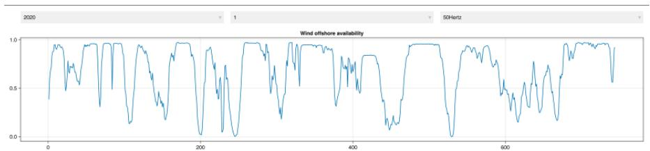
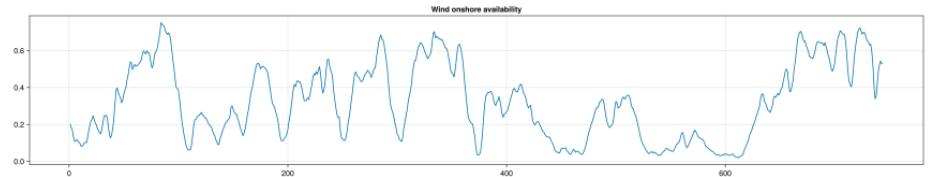
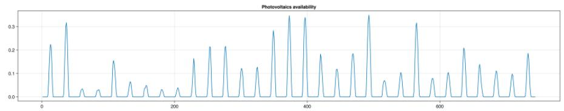
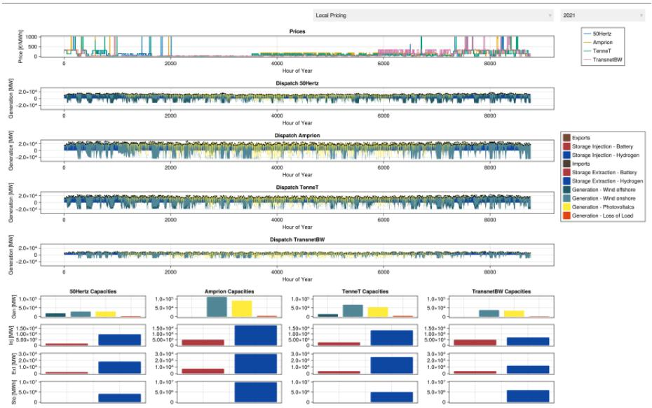
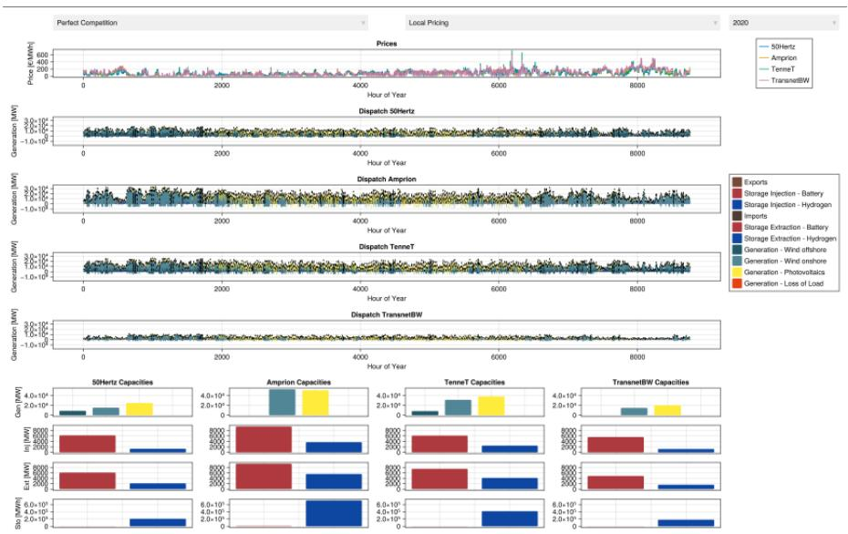

# Part PT

# Project Task

## PT.1 Project Task Formalities

In this part, you will find the project task for the course. The project is a significant component of the course examination (30 of 100 Points) and allows you to apply the concepts and methods learned throughout the lectures and exercises to a real-world problem. There are a few ground rules:

- You are allowed to work in groups of two students (but not required to do so).
- However, you must submit your project solution individually (via isis).

- You have to indicate in your submission that you worked together with another student
- At the top of the run file, you should change the dummy numbers to the actual matriculation numbers of the group members (see the file in the project folder).
- If you do not submit a project solution, you will receive 0 points for the project part of the examination (even if your group member submits a solution).

- Deadline for submission is end of March. Late submissions will not be accepted.

The project is handed out as a template file. This file consists of the following components:

- Data: folder containing the relevant data for the project.
- src.jl: Julia file containing the skeleton code for the project. It includes a few functions already, that show you in an exemplary fashion how to implement the required functions.
- test.jl: Julia file containing a test script. This allows you to check whether your implementation is correct. You can run this file after you have implemented the required functions in src.jl. If all tests pass, you can be confident that your implementation is correct (unless you hard-coded the tests, obviously).

- run.jl: Julia file containing the main script for the project. You can run this file to execute your project solution.
- test_data: folder containing loadable Julia data structures that contain the target solutions. You can use these data structures to check your results against the expected outcomes.

- All data structures in the test_data folder are saved with the JLD2.jl package. You can load them with the following code:

@load joinpath(@_DIR_, "test_data", "data.jld2") data

- For further information on how to use the JLD2.jl package, see the documentation at <https://juliaio.github.io/JLD2.jl/stable/>.

- results: folder where you are required to save your results (structured the same way as the test_data folder).
- manifest.toml and a project.toml file for the Julia environment. You can use this environment to run the project code.

- Warning: You are not allowed to use any other packages than those specified in the project environment (except for a different solver, if you do not want to obtain an academic license for Gurobi).

Upon submission, it is required that you rename the template folder to your matriculation number (six digits only)!

As introduced in the last lecture session, you will work on the task of dimensioning a $100\%$ renewable power system for a simplified model of Germany. The goal is to determine the optimal capacities of generation and storage technologies as well as the optimal operation of these technologies over the course of one year at hourly resolution for various market configurations and weather years. You will work with real data provided by the federal network agency (Bundesnetzagentur) for each of the four German electricity Transmission System Operators (TSOs).<sup>1</sup> The following tasks will take you through the necessary steps to implement some suitable models in Julia.

## PT.2 Project Task Descriptions

### PT.2.1 Data Preparation (Already Implemented in src.jl)

This part of the project is already implemented in the provided src.jl file. You can use this as a reference for how to implement the required functions.

Write a function `combine_data()` that reads in the provided csv files inside the Data folder and combines them into a single dataframe (of your choice) that holds all relevant information for further processing. You may use the provided test data structure `test_data/data.jld2` to check whether your implementation is correct. You should proceed along the following lines:

- Read in generation, demand, capacity and price data from the respective csv files for all four German TSO areas.

- There are actually a few caveats in this, including (but not limited to) how to work with summer/winter time etc. and renaming some columns
- You should replace all missing values by zeros.

- Join the data into a single DataFrame that holds the following columns:

- Start date
  Year
- Month
  Day
  hour_of_year
  Area
- grid load [MWh]
- Wind offshore [MWh]
- Wind onshore [MWh]

- Photovoltaics [MWh]
  Germany/Luxembourg [€/MWh]
- Wind offshore [MW]
- Wind onshore [MW]
- Photovoltaics [MW]

- Use the available data to calculate the availability of Wind offshore, Wind onshore, and Photovoltaics. The availability is the ratio of generation to installed capacity. - Be careful, not all data is provided at the same granularity. To get valid capacities, you may assume that all new generation is mysteriously installed between the last hour of any given year and the first hour of the following one. $^{1}$
- Then, similar to the exercise in Section E.8.2, you should use the price and load data to calculate the parameters of a first order approximation to the inverse demand function for each TSO area. You may use a price elasticity of demand of $\sigma = 0.2$ for all areas.

$$
p (Q) = a + b * (Q) \tag {PT.2.1a}
$$

$$
b = \frac {p^{ref}}{Q^{ref}} \cdot \frac {1}{\sigma} \tag {PT.2.1b}
$$

$$
a = p^{ref} - b \cdot Q^{ref} = p^{ref} - \frac {p^{ref}}{\sigma} \tag {PT.2.1c}
$$

- Finally, save the resulting DataFrame with JLD2.jl as joinpath(@_DIR_, "results", "data.jld2").

Whenever you are not exactly sure about what is supposed to come out of the function, you can always check the target data sheet test_data/data.jld2 to see what the expected output looks like.







Figure PT.2.1: Example of a data inspection visualization for the availability data.

### PT.2.2 Data Preparation visualization (Already Implemented in src.jl)

This part of the project is already implemented in the provided src.jl file. You can use this as a reference for how to implement the required functions.

Write a function create_data_inspection() that creates a visualization that allows you to inspect the availability data for each TSO area, weather year and month. It should look pretty similar to Figure PT.2.1. Your function should not take an argument, but should read in the data from

joinpath(@_DIR_, "results", "data.jld2"). If you did not manage to create the data file, you can use the provided test data structure test_data/data.jld2 to write this.

### PT.2.3 Cost Optimization Model (7.5 Points)

Implement a linear optimization model for a multi-zone power system with endogenous investment and operational decisions. Define the following index sets:

- $\mathcal{G}$ : generation technologies (Wind offshore, Wind onshore, Photovoltaics, Loss of Load)
- $\mathcal{S}$ : storage technologies (Batteries, Hydrogen)
- $\mathcal{Z}$ : zones (four German TSO areas)
- $\mathcal{T}$ : time steps (8760 hours in a year)
- and a mapping that assigns to each hour the previous one (as during the lecture the hour before the first hour is the last one).

Then introduce the following non-negative continuous variables:

- Investment variables (capacity decisions):

- Installed generation capacity per technology and zone
- Installed storage energy capacity per storage technology and zone
- Installed injection (charging) power capacity per storage and zone
- Installed extraction (discharging) power capacity per storage and zone

- Operational variables (time-dependent):

- Generation output per technology, zone, and time
- Injection (charging) per storage, zone, and time
- Extraction (discharging) per storage, zone, and time
- Storage state of charge per storage, zone, and time
- Power flow between every pair of zones and time, bounded above by an exogenous transmission capacity parameter

The objective is to minimize total system cost consisting of:

- Generation investment costs (capacity times technology-specific unit cost)

- Storage energy capacity investment costs
- Injection power capacity investment costs
- Extraction power capacity investment costs
- Variable generation costs (dispatch times marginal cost)
- Linear transmission flow costs (flow times per-unit flow cost)

And is constrained by:

- Generation Availability Constraint: For every generation technology, zone, and time generation output must not exceed installed generation capacity multiplied by an exogenous availability factor (as calculated in your data).
- Injection Power Limit: For every storage technology, zone, and time charging power must not exceed installed injection capacity.
- Extraction Power Limit: For every storage technology, zone, and time:

Discharging power must not exceed installed extraction capacity.

- Storage Energy Capacity Limit: For every storage technology, zone, and time state of charge must not exceed installed storage energy capacity.
- Storage Dynamics: For every storage technology, zone, and time state of charge at time $t$ equals state of charge at previous time plus injection at time $t$ minus extraction at time $t$ . The efficiencies should be handled in the market clearing constraint.
- Market Clearing (Zonal Energy Balance): For every zone and time total supply must be greater than or equal to total demand.

- Left-hand side (supply):

- Sum of generation in the zone
- Sum of storage extraction multiplied by discharge efficiency
- Sum of inflows from all other zones

- Right-hand side (demand):

- Exogenous demand
- Injection divided by charging efficiency
- Sum of outflows to all other zones

Table PT.2.1 provides an overview of the sets required.
Table PT.2.1: Model Sets for Project Task.

<table><tr><td>Set</td><td>Elements</td></tr><tr><td>Storage technologies S</td><td>Battery, Hydrogen</td></tr><tr><td>Generation technologies G</td><td>Wind offshore, Wind onshore, Photovoltaics, Loss of Load</td></tr><tr><td>Zones Z</td><td>50Hertz, Amprion, TenneT, TransnetBW</td></tr><tr><td>Time steps T</td><td>t = 1, . . ., 8760</td></tr></table>

Table PT.2.2 depicts the marginal generation and investment costs for the different generation technologies. The cost of loss of load is set to 1000 €/MWh and modeled as a generation technology. However, since we are only modeling a single year, we have to annuitize the investment costs for generation and storage technologies. You can use a discount rate of $5\%$ and assume a lifetime of 30 years on all assets, except for batteries where you can assume a lifetime of 15 years. The annuity factor can be calculated as follows:

$$
\text{annuity\_factor}(r, n) = \frac {r}{1 - (1 + r)^{-n}} \tag {PT.2.2}
$$

Table PT.2.2: Generation investment and marginal costs

<table><tr><td>Technology</td><td>Investment cost [€/MW]</td><td>Marginal cost [€/MWh]</td></tr><tr><td>Wind offshore</td><td>2.8 · 10<sup>6</sup></td><td>1</td></tr><tr><td>Wind onshore</td><td>1.2 · 10<sup>6</sup></td><td>1</td></tr><tr><td>Photovoltaics</td><td>0.6 · 10<sup>6</sup></td><td>1</td></tr><tr><td>Loss of Load</td><td>1</td><td>1000</td></tr></table>

Table PT.2.3 depicts the investment costs for storage energy capacity, injection power capacity, and extraction power capacity for the two storage technologies. Further, charging and discharging efficiencies are indicated. The marginal costs of storage operation are set to zero.

Transport capacities are scenario dependent. In one case, you must assume, that no transport between the zones is possible. In the other case, you can assume that transport capacities are sufficiently large such that they do not bind (e.g., 100 GW between every

Table PT.2.3: Storage investment costs and efficiencies

<table><tr><td>Technology</td><td>Capacity [€/MWh]</td><td>Injection [€/MW]</td><td>Extraction [€/MW]</td><td>Inj eff</td><td>Ext eff</td></tr><tr><td>Battery</td><td>0.3·10<sup>6</sup></td><td>1</td><td>1</td><td>0.95</td><td>0.95</td></tr><tr><td>Hydrogen</td><td>0.003·10<sup>6</sup></td><td>1.4·10<sup>6</sup></td><td>0.6·10<sup>6</sup></td><td>0.60</td><td>0.60</td></tr></table>

pair of zones). Now make use of the calculated availabilities and demand parameters, to solve the optimization problem for both transport scenarios and all weather years (2020-2025) individually. You should then solve the outcomes of all combinations of transport scenarios and weather years into a dict. This dict should :

- Use the weather year as the first key and the transport scenario as the second key (e.g., results[2020][true] should give you the results for the 2020 weather year and local pricing (i.e. no transmission capacity) scenario)
- Hold a dict with the following information for each scenario combination:

- "extraction": result for the extraction variable
- "demand": result for the demand (exogenous data), but as a DenseAxisArray with the same structure as the other variables (i.e., indexed by zone and time)
- "storage_level": result for the storage level variable
- "injection_capacity": result for the injection capacity variable
- "prices": result for the prices (i.e., duals to the market clearing constraint)
- "injection": result for the injection variable
- "generation": result for the generation variable
- "storage_capacity": result for the storage capacity variable
- "generation_capacity": result for the generation capacity variable
- "total_cost": the optimal objective value of the cost minimization problem
- "flow": result for the flow variable
- "extraction_capacity": result for the extraction capacity variable
- You can use the provided test data structure test_data/deterministic_cost_minimization_results.jld2 to check whether your implementation is correct.<sup>2</sup>


Figure PT.2.2: Example of a cost optimization visualization for the deterministic model.

Your function get_deterministic_cost_minimization_results(optimizer) should save a dict exactly like test_data/deterministic_cost_minimization_results.jld2 and return nothing.

### PT.2.4 Visualization of Cost Optimal Solution (2.5 Points)

#### Write a function

create_deterministic_cost_minimization_results_visualization() that creates a visualization that allows you to inspect the dispatch and capacity investments. It should look pretty similar to Figure PT.2.2. Your function can either take the grid constraint and weather year as arguments, or include them in an interactive plot using GLMakie.<sup>3</sup> However, it should read in the data from joinpath(@_DIR_, "results"). If you did not manage to create the data file (or decided to do the plotting first), you

can use the provided test data structure in test_data to write this function. The plotting colors are given by Listing PT.2.1.

Listing PT.2.1: Term Project Color Map
```julia
cmap = Dict(
    "Storage Injection - Battery" => "#ae393f",
    "Storage Injection - Hydrogen" => "#0d47a1",
    "Storage Extraction - Battery" => "#ae393f",
    "Storage Extraction - Hydrogen" => "#0d47a1",
    "Imports" => "#4d3e35",
    "Exports" => "#754937",
    "Generation - Loss of Load" => "#e54213",
    "Generation - Wind offshore" => "#215968",
    "Generation - Wind onshore" => "#518696",
    "Generation - Photovoltaics" => "#ffeb3b",
)
```

### PT.2.5 Welfare Optimization Model (7.5 Points)

Now turn your model into a welfare optimization model. Write a function get_deterministic_welfare_maximization_results(optimizer) that implements the necessary changes to the cost optimization model to turn it into a welfare optimization model. You should now assume, that each TSO operates the assets in its zone.<sup>4</sup> Therefore, the model should now include the following variables:

- Generation capacity of each firm for each generation technology located in each zone (i.e. 3 axes: firm, technology, location)
- Storage capacity of each storage technology in each zone (i.e. 2 axes: storage technology, location)

- Injection capacity of each storage technology in each zone (i.e. 2 axes: storage technology, location)
- Extraction capacity of each storage technology in each zone (i.e. 2 axes: storage technology, location)
- Storage level of each firm for each storage technology in each zone and time period (i.e. 4 axes: firm, storage technology, location, time)
- Generation of each firm for each generation technology in each zone and time period (i.e. 4 axes: firm, technology, location, time)
- Injection of each firm for each storage technology in each zone and time period (i.e. 4 axes: firm, storage technology, location, time)
- Extraction of each firm for each storage technology in each zone and time period (i.e. 4 axes: firm, storage technology, location, time)
- Flow of each firm from origin zone to destination zone in each time period (i.e. 4 axes: firm, origin, destination, time)
- Sales $Q$ of each firm in each zone and time period (i.e. 3 axes: firm, location, time)

Then, solve the model for the same scenarios as before and save the results into a dict called

results/deterministic_welfare_maximization_results.jld2. It should look like test_data/deterministic_welfare_maximization_results.jld2.

The dict should have the following structure:

- Use the weather year as the first key and the transport scenario as the second key (e.g., results[2020][true] should give you the results for the 2020 weather year and local pricing (i.e. no transmission capacity) scenario)
- Hold a dict with the following information for each scenario combination:

- "extraction": result for the extraction variable
- "demand": result for the demand (endogenously determined), as a DenseAxisArray with the same structure as the other variables (i.e., indexed by zone and time)
- "storage_level": result for the storage level variable
- "injection_capacity": result for the injection capacity variable

- "prices": result for the prices (calculated from the inverse demand function using the sales variable)
- "injection": result for the injection variable
- "generation": result for the generation variable
- "storage_capacity": result for the storage capacity variable
- "generation_capacity": result for the generation capacity variable
- "total_cost": the optimal objective value of the maximization problem<sup>5</sup>
- "flow": result for the flow variable
- "extraction_capacity": result for the extraction capacity variable
- The dict should be structurally similar to the linear cost minimization case, but obviously some of the variables would have more axes.

### PT.2.6 Strategic Behavior (7.5 Points)

Now, derive an adequate convex reformulation of the equilibrium/complementarity problem when each zone is represented by a strategic player that maximizes its own profit. You should use the TSO's as in the welfare optimization task, but this time with market power. Implement the reformulation in a function

get_deterministic_strategic_behavior_results(optimizer) and solve the model for the same scenarios as before. Save the results into a dict called results/deterministic_strategic_behavior_results.jld2. It should look like test_data/deterministic_strategic_behavior_results.jld2, and be structured like the dict of the welfare optimization task.

### PT.2.7 Visualization of Elastic Models (5 Points)

Write a function

create_deterministic_elastic_results_visualization() that creates a



Figure PT.2.3: Example of a welfare optimization visualization for the deterministic model.

visualization that allows you to inspect the dispatch and capacity investments. It should look pretty similar to Figure PT.2.3. Your function can either take the grid constraint, behavior, and weather year as arguments, or include them in an interactive plot using GLMakie. However, it should read in the data from joinpath(@_DIR_, "results"). If you did not manage to create the data file, you can use the provided test data structure in test_data to write this function.

### PT.2.8 Bonus: Stochastic Dual Dynamic Programming (5 Points)

Create a two stage stochastic optimization problem and implement a solution with SDDP.jl in the function get_stochastic_cost_minimization_results(optimizer, local_pricing, iteration_limit = 1, lower_bound = -Inf). Your model should have investment decisions on the first stage, and operational decisions on the second stage. Uncertainty should be represented by a set of scenarios that differ in their availability of renewable generation and demand. You can use the provided test data structure test_data/stochastic_cost_minimization_results.jld2 to check whether your implementation yields the right structures. $^6$ Finally, also visualize your results in a similar way to Figure PT.2.3, using a function

create_stochastic_cost_minimization_results_visualization().
